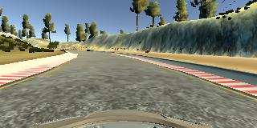
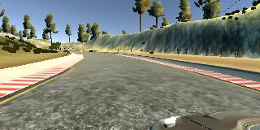
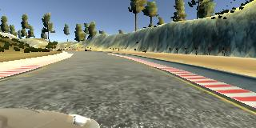
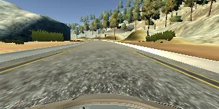
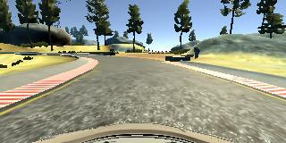
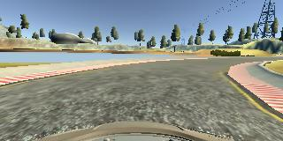

#**Behavioral Cloning** 


---

**Behavioral Cloning Project**

The goals / steps of this project are the following:
* Use the simulator to collect data of good driving behavior
* Build, a convolution neural network in Keras that predicts steering angles from images
* Train and validate the model with a training and validation set
* Test that the model successfully drives around track one without leaving the road
* Summarize the results with a written report


[//]: # (Image References)

[image1]: ./center_2017_05_18_04_59_10_336.jpg "Center Image"
[image2]: ./examples/placeholder.png "Grayscaling"
[image3]: ./examples/placeholder_small.png "Recovery Image"
[image4]: ./examples/placeholder_small.png "Recovery Image"
[image5]: ./examples/placeholder_small.png "Recovery Image"
[image6]: ./examples/placeholder_small.png "Normal Image"
[image7]: ./examples/placeholder_small.png "Flipped Image"

## Rubric Points
###Here I will consider the [rubric points](https://review.udacity.com/#!/rubrics/432/view) individually and describe how I addressed each point in my implementation.  

---
###Files Submitted & Code Quality

####1. Submission includes all required files and can be used to run the simulator in autonomous mode

My project includes the following files:
* model.py containing the script to create and train the model
* drive.py for driving the car in autonomous mode
* model.h5 containing a trained convolution neural network 
* writeup_report.md
* run1.mp4 which is the video fo the car run in autonomous mode.

####2. Submission includes functional code
Using the Udacity provided simulator and my drive.py file, the car can be driven autonomously around the track by executing 
```sh
python drive.py model.h5
```

####3. Submission code is usable and readable

The model.py file contains the code for training and saving the convolution neural network. The file shows the pipeline I used for training and validating the model, and it contains comments to explain how the code works.

###Model Architecture and Training Strategy

####1. An appropriate model architecture has been employed

I adopted the Nvidia architecture to train my model.
It has five convolutional layers with four fully connected layers.(mode.py lines 59 to lines 71)

####2. Attempts to reduce overfitting in the model

The model was trained and validated on different data sets to ensure that the model was not overfitting (code line 16 to 30). 
I used all the three images(center, left and right images to train my model. Also flipped the images to get more data.
The model was tested by running it through the simulator and ensuring that the vehicle could stay on the track.

####3. Model parameter tuning

The model used an adam optimizer, so the learning rate was not tuned manually (model.py line 76).

####4. Appropriate training data

Training data was chosen to keep the vehicle driving on the road. I used a combination of center lane driving, recovering from the left and right sides of the road. I added a correction of 0.2 to steering angle to the left and right images. I played with several different values for correction, 0.2 turned out to be the best.(lines 24-26) 
<br>
#####Center Image

<br>
#####Left Image

<br>
#####Right Image


For details about how I created the training data, see the next section. 

###Model Architecture and Training Strategy

####1. Solution Design Approach

The overall strategy for deriving a model architecture was to not to overfit the data and train the model with less validation loss.

I started with the Lenet architecture. The reason I chose this model because this model was already proven in my previous exercises.And also here we are dealing with images I felt this will be a good match.


In order to gauge how well the model was working, I split my image and steering angle data into a training and validation set.I used 20 percent of the data for validation.
I found that my first model had a low mean squared error on the training set but a high mean squared error on the validation set. This implied that the model was overfitting. To reduce the overfitting I normalised the images using lamda layers.In this project, a lambda layer is a convenient way to parallelize image normalization. The lambda layer will also ensure that the model will normalize input images when making predictions in drive.py. 

At first I ran my model with more than 7 epochs which led to overfitting.To combat the overfitting, I reduced the number of epochs. I used only 3 epochs to train the model.


The final step was to run the simulator to see how well the car was driving around track one. There were a few spots where the vehicle fell off the track.Mostly this happened during the steep edges of the road. I struggled a lot to identify what was going wrong. I see the model ran well with less validation loss but still the car is failing at the steep edges.

Then I added more training data:
1)3 laps center lane driving
2)1 lap reverse driving
3)1 lap mostly covering the steep turns.
4)1 lap recovering from the steep turns.

Even after this additional data the model was failing. Then with the help of slack channel I was able to find out waht was going wrong.
drive.py sends RGB images to the model; cv2.imread() reads images in BGR format. I changed the image format to RGB and car passed the steep corners:)
At the end of the process, the vehicle is able to drive autonomously around the track without leaving the road.

####2. Final Model Architecture

My first step was to use a convolution neural network model similar to the Nvidia architecture. I thought this model might be appropriate because Nvidia might already have tested this model on self driving cars.
It has five convolutional layers with four fully connected layers.(mode.py lines 59 to lines 71)


####3. Creation of the Training Set & Training Process

To capture good driving behavior, I first recorded two laps on track one using center lane driving.

I then recorded the vehicle recovering from the left side and right sides of the road back to center so that the vehicle would learn to   move away from the corners whn car is drifting towards corners. I used a coorection factor of 0.2.

To augment the data set, I also flipped images and angles because flipped images have completely opposite steering angles. 


After the collection process, I had around 40000 number of data points. I then preprocessed this data by ...


I finally randomly shuffled the data set and put 20% of the data into a validation set. 

I used this training data for training the model. The validation set helped determine if the model was over or under fitting. The ideal number of epochs was 3 as evidenced by validation loss.With more than 3 epochs the validation loss increased. I used an adam optimizer so that manually training the learning rate wasn't necessary.

Below are the images of a successful run on straight road, left and right turns.
<br>
#####Straight road

<br>
#####Left Turn

<br>
#####Right Turn

